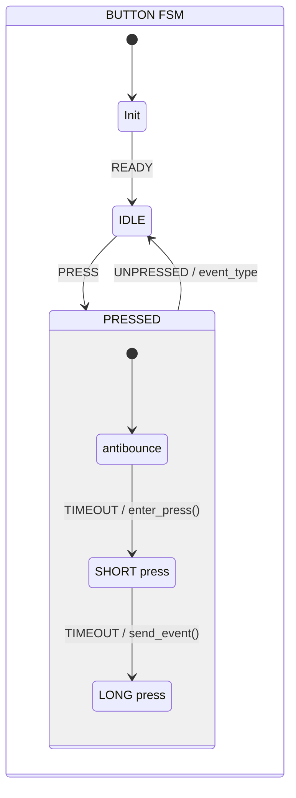

```mermaid
stateDiagram-v2
    state ROOT_ST {
        [*] --> INIT_ST
        INIT_ST --> IDLE_ST : READY 
        IDLE_ST --> PRESS_ST : PRESS 
        state PRESS_ST {
            [*] --> WAIT_ST
            WAIT_ST --> S_PRESS_ST : TIMEOUT / enter_press()
            S_PRESS_ST --> L_PRESS_ST : TIMEOUT / send_event()
        }
        PRESS_ST --> IDLE_ST : UNPRESSED / event_type
        IDLE_ST : IDLE
    }

    L_PRESS_ST : LONG press
    PRESS_ST : PRESSED
    INIT_ST : Init
    WAIT_ST : antibounce 
    S_PRESS_ST : SHORT press 
    ROOT_ST : BUTTON FSM
```