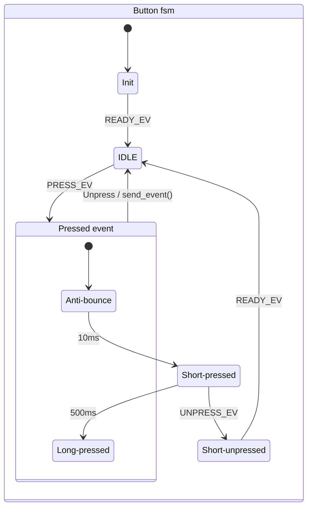

```mermaid
stateDiagram-v2
	state ROOT_ST {
		[*] --> INIT_ST
		INIT_ST
		IDLE_ST
		PRESS_ST
		S_PRESS_ST
		S_UNPRESS_ST
	}

	state PRESS_ST {
		[*] --> WAIT_ST
		WAIT_ST
		L_PRESS_ST
	}

	 INIT_ST --> IDLE_ST : READY_EV
	 IDLE_ST --> PRESS_ST : PRESS_EV
	 PRESS_ST --> IDLE_ST : Unpress / send_event()
	 WAIT_ST --> S_PRESS_ST : 10ms
	 S_PRESS_ST --> L_PRESS_ST : 500ms
	 S_PRESS_ST --> S_UNPRESS_ST : UNPRESS_EV
	 S_UNPRESS_ST --> IDLE_ST : READY_EV

	ROOT_ST : Button fsm
	INIT_ST : Init
	IDLE_ST : IDLE
	PRESS_ST : Pressed event
	WAIT_ST : Anti-bounce
	S_PRESS_ST : Short-pressed
	L_PRESS_ST : Long-pressed
	S_UNPRESS_ST : Short-unpressed
```