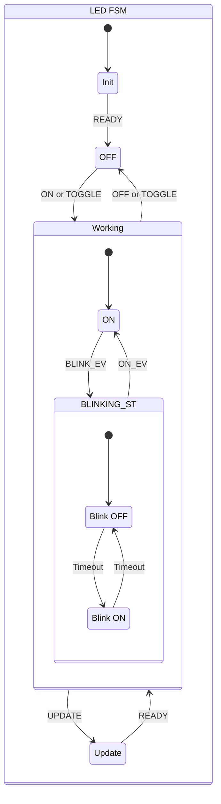

```mermaid
stateDiagram-v2
	state ROOT_ST {
		[*] --> INIT_ST
		INIT_ST
		OFF_ST
		ON_ST
		UPDATE_ST
	}

	state ON_ST {
		[*] --> ON_FIX_ST
		ON_FIX_ST
		BLINKING_ST
	}

	state BLINKING_ST {
		[*] --> BLINK_OFF_ST
		BLINK_OFF_ST
		BLINK_ON_ST
	}

	INIT_ST --> OFF_ST : READY
	OFF_ST --> ON_ST : ON or TOGGLE
	ON_ST --> OFF_ST : OFF or TOGGLE
	ON_ST --> UPDATE_ST : UPDATE
	BLINKING_ST --> ON_FIX_ST : ON_EV
	BLINK_OFF_ST --> BLINK_ON_ST : Timeout
	BLINK_ON_ST --> BLINK_OFF_ST : Timeout
	UPDATE_ST --> ON_ST : READY
	ON_FIX_ST --> BLINKING_ST : BLINK_EV

	ROOT_ST: LED FSM
	OFF_ST : OFF
	ON_ST : Working
	INIT_ST : Init
	ON_FIX_ST : ON
	BLINK_ON_ST : Blink ON
	BLINK_OFF_ST : Blink OFF
	UPDATE_ST : Update
```