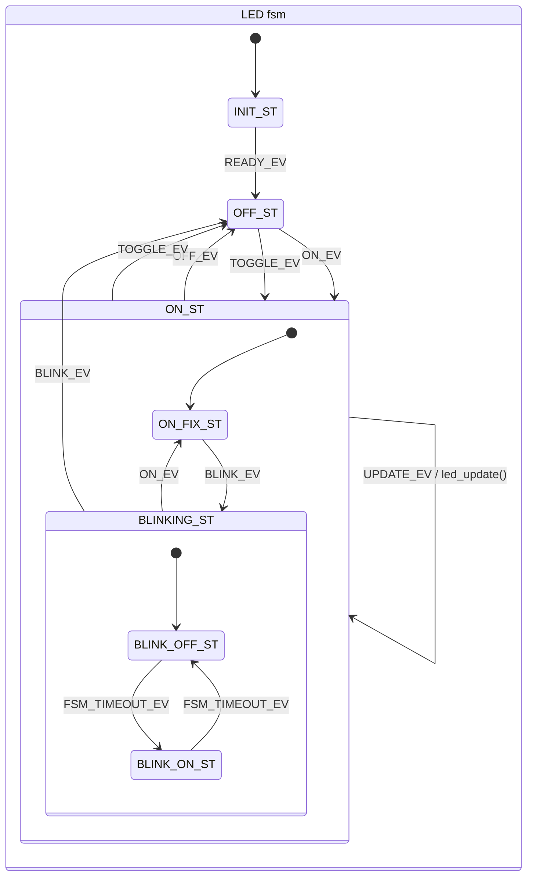

```mermaid
stateDiagram-v2
	state ROOT_ST {
		[*] --> INIT_ST
		INIT_ST
		OFF_ST
		ON_ST
	}

	state ON_ST {
		[*] --> ON_FIX_ST
		ON_FIX_ST
		BLINKING_ST
	}

	state BLINKING_ST {
		[*] --> BLINK_OFF_ST
		BLINK_ON_ST
		BLINK_OFF_ST
	}

	 INIT_ST --> OFF_ST : READY_EV
	 OFF_ST --> ON_ST : ON_EV
	 OFF_ST --> ON_ST : TOGGLE_EV
	 ON_ST --> OFF_ST : OFF_EV
	 ON_ST --> OFF_ST : TOGGLE_EV
	 ON_FIX_ST --> BLINKING_ST : BLINK_EV
	 BLINK_ON_ST --> BLINK_OFF_ST : FSM_TIMEOUT_EV
	 BLINK_OFF_ST --> BLINK_ON_ST : FSM_TIMEOUT_EV
	 BLINKING_ST --> ON_FIX_ST : ON_EV
	 BLINKING_ST --> OFF_ST : BLINK_EV
	 ON_ST --> ON_ST : UPDATE_EV / led_update()

	ROOT_ST : LED fsm
```